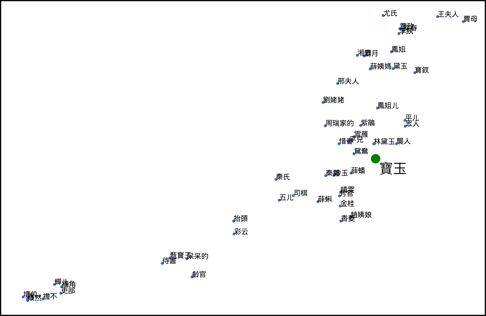

# SeqWORDS package
SeqWORDS is an unsupervised Chinese word segmentation method, which not demand a dictionary in hand. This package is an implementation of SeqWORDS algorithm on python.
## Installation
To install this package, execute command below in terminal.
```bash
pip install SeqWORDS
```
## Usage
```python
import SeqWORDS
corpus = # YOUR TARGET CORPUS
# Set a SW object
SW = SeqWORDS.WDMtwseq(corpus, 
                        tauL = 10, tauF = 3, 
                        iter_time_total = 10, convergeThld = 0.1, 
                        useProbThld1 = 10e-10, useProbThld2 = 10e-10)
# Run EM algoritm
SW.run()
# Segmentation
SW.cut(connectThld = 0.5)
```
## Parameter
| parameter        | type | description                                      |
| ---------------- | ---  | ------------------------------------------------ |
| `tuaL`           | Int  | assume the longest word contain tuaL characters|
| `tuaF`           | Int  | remove words from initial dict that relative occurence lower than tauF|
| `iter_time_total`| Int  | max EM iteration time |
| `convergeThld`   | Int  | EM convergence threshold |
| `useProbThld1`   | Int  |  minimum word use probability|
| `useProbThld2`   | Int  |  minimum two words sequence use probability|
| `connectThld`    | Int  | if alpha bigger than connectThld then combine two words|
## Example
### Story of Stone
Story of Stone, also called Dream of the Red Chamber, composed by Xueqin Cao in 18th century during the Qing dynasty. The novel features in massive number of characters.
### Results
Below is word cloud, it shows the most frequent words. "寶玉" is the biggest one amoung of all cloud. 
<figure>


</figure>

Below is PCA of word vectors. The plot containing 51 words includes "寶玉" and 50 words that most relative to "寶玉". Amoung these words, there 42 names has great relativity to "寶玉". 

<figure>

<figcaption> </figcaption>
</figure>

## License
[MIT](https://choosealicense.com/licenses/mit/)
